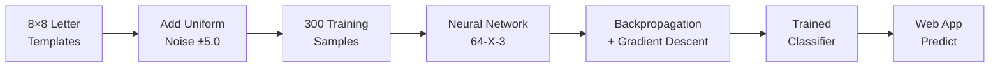
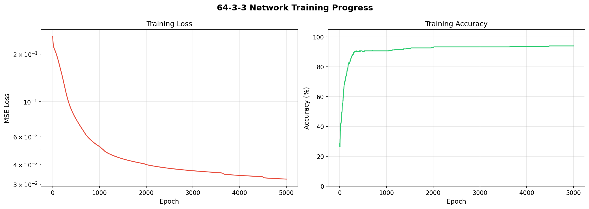
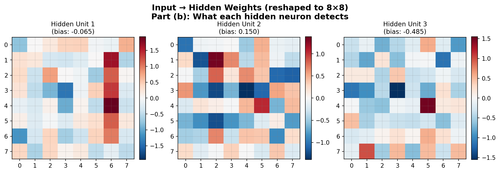
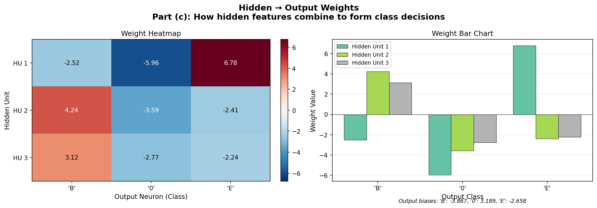
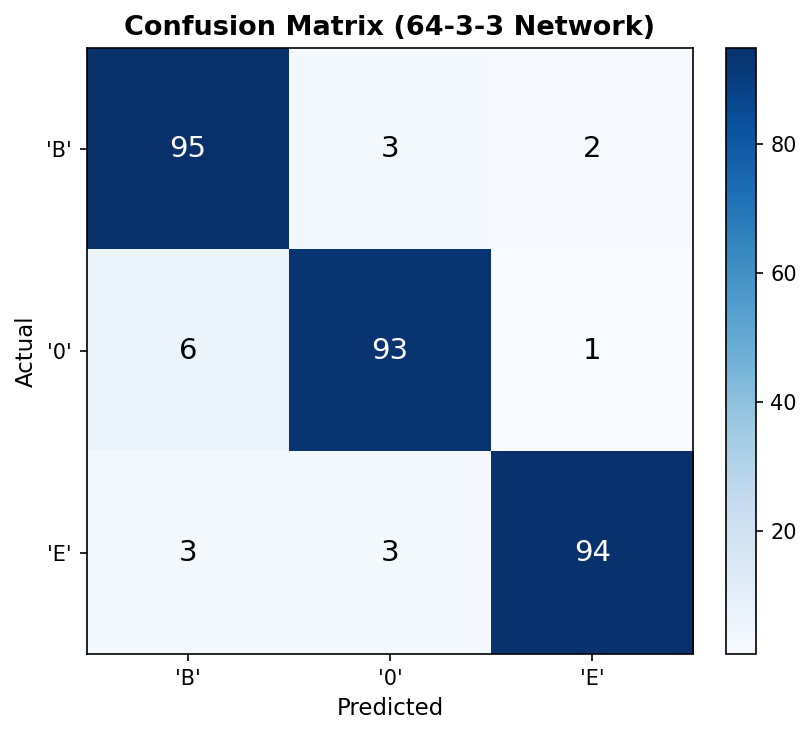
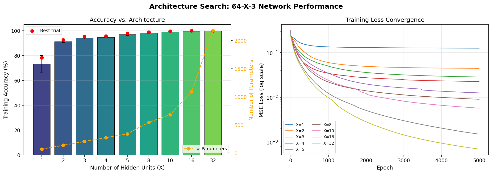
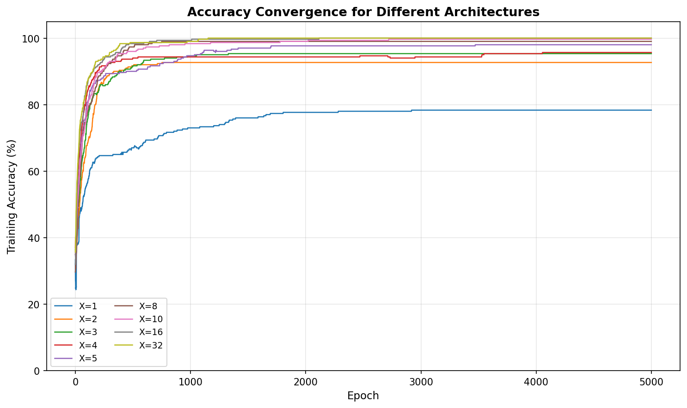
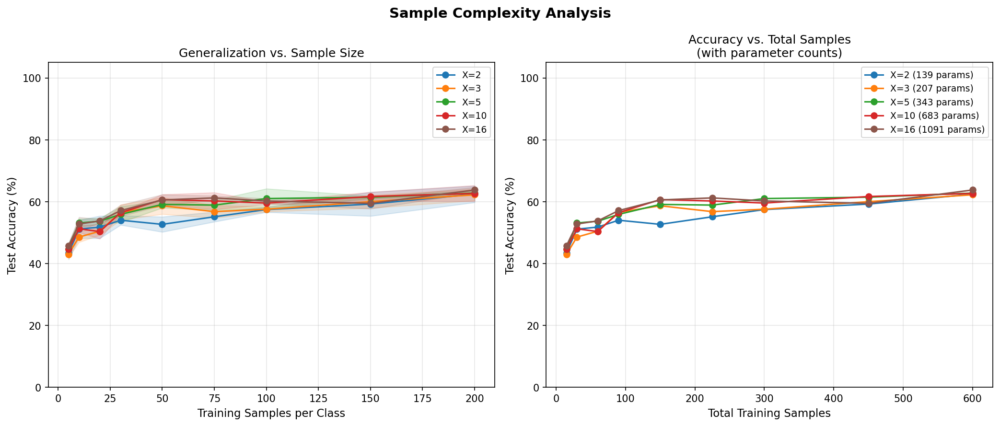

<p align="center">
  <h1 align="center">🧠 Neural Net Letter Classifier</h1>
  <p align="center">
    <strong>A from-scratch neural network built entirely in NumPy — no TensorFlow, no PyTorch.</strong><br/>
    Classifies handwritten letters <b>B</b>, <b>0</b> (zero), and <b>E</b> from noisy 8×8 pixel images.
  </p>
  <p align="center">
    
    
    
    
  </p>
</p>

---

## ✨ Why This Project Stands Out

| What | Why It Matters |
|------|---------------|
| 🔧 **Built from scratch** | Every component — forward pass, backpropagation, gradient descent — is implemented manually. No `model.fit()` magic. |
| 📐 **Math-first approach** | Xavier initialization, sigmoid derivatives, MSE gradients — all derived and coded by hand. |
| 🔍 **Architecture search** | Systematically tested 9 different architectures (X ∈ {1–32}) with statistical robustness (5 trials each). |
| 📊 **Sample complexity analysis** | Studied how training set size affects generalization across architectures. |
| 🌐 **End-to-end web app** | Not just a notebook — includes a Flask app with image upload, canvas drawing, and real-time prediction. |
| 📈 **Rich visualizations** | Weight heatmaps, confusion matrices, convergence plots, and architecture comparison charts. |

---

## 🎯 Project Overview

This project tackles a **3-class character recognition problem** using a single hidden-layer feedforward neural network. The characters B, 0, and E are represented as 8×8 binary pixel grids, corrupted with heavy uniform noise, and classified using a network trained entirely via backpropagation.

### The Pipeline



---

## 🏗️ Network Architecture

```
Input Layer (64 neurons)          Hidden Layer (X neurons)          Output Layer (3 neurons)
┌─────────────────────┐          ┌──────────────────┐              ┌──────────────┐
│                     │          │                  │              │              │
│  8×8 pixel image    │── W1 ──▶│  Sigmoid units   │── W2 ──────▶│  B  (σ)      │
│  flattened to 64    │  + b1   │  Xavier init     │   + b2       │  0  (σ)      │
│  features           │         │                  │              │  E  (σ)      │
│                     │         │                  │              │              │
└─────────────────────┘         └──────────────────┘              └──────────────┘
```

### Key Implementation Details

<table>
<tr>
<td width="50%">

**Forward Pass**
```
z₁ = X · W₁ + b₁
a₁ = σ(z₁)
z₂ = a₁ · W₂ + b₂
a₂ = σ(z₂)    ← predictions
```

</td>
<td width="50%">

**Backward Pass (Backpropagation)**
```
δ₂ = (a₂ − y) ⊙ σ'(z₂)
δ₁ = (δ₂ · W₂ᵀ) ⊙ σ'(z₁)
∇W₂ = a₁ᵀ · δ₂ / n
∇W₁ = Xᵀ · δ₁  / n
```

</td>
</tr>
</table>

- **Activation**: Sigmoid with overflow clipping at ±500
- **Loss**: Mean Squared Error (MSE)
- **Optimizer**: Full-batch gradient descent (lr = 0.5)
- **Initialization**: Xavier/Glorot — `W ~ N(0, √(2/(fan_in + fan_out)))`

---

## 📊 Results

### Training Performance (64-3-3 Network)

<p align="center">
  
</p>

### What Each Hidden Neuron Learned (Weight Visualization)

<p align="center">
  
</p>

> Each hidden unit's 64 weights reshaped as 8×8 reveal the spatial pattern it detects — vertical strokes, horizontal bars, or curved regions that distinguish B from E and 0.

### Decision Logic (Hidden → Output Weights)

<p align="center">
  
</p>

### Classification Accuracy

<p align="center">
  
</p>

---

## 🔍 Architecture Search

Tested **9 architectures** (X ∈ {1, 2, 3, 4, 5, 8, 10, 16, 32}) with 5 random initializations each to find the optimal hidden layer size.

<p align="center">
  
</p>

<p align="center">
  
</p>

### Sample Complexity

How many training samples does each architecture need to generalize?

<p align="center">
  
</p>

---

## 🌐 Web Application

A **Flask web app** that lets you upload an image or draw directly on a canvas, then classifies the letter in real-time.

### Features
- 📁 **Image upload** — drag & drop or click to browse (PNG, JPG, BMP)
- ✏️ **Canvas drawing** — draw with mouse or touch, then classify
- 🔄 **Smart preprocessing** — auto-crop, resize to 8×8, normalize
- 📊 **Confidence bars** — animated per-class probability visualization
- 🖼️ **Preprocessed preview** — see exactly what the network sees
- 📱 **Responsive design** — works on desktop and mobile

### Preprocessing Pipeline

```
Upload/Draw → Grayscale → Binary threshold → Crop to bounding box
→ Resize to 7×7 → Place in 8×8 grid with padding → Normalize to [-1, +1]
→ Flatten to 64-dim vector → Feed to network
```

---

## 📁 Project Structure

```
neural-net-letter-classifier/
│
├── data_generation.py          # 8×8 letter templates + noisy dataset generation
├── neural_network.py           # NeuralNetwork class — forward, backward, train, predict
├── train_and_visualize.py      # Training + weight visualization (Parts a, b, c)
├── architecture_search.py      # Hidden-unit sweep + sample complexity (Part e)
├── app.py                      # Flask web application (Part d)
│
├── templates/
│   └── index.html              # Web UI — upload, canvas draw, confidence display
│
├── model/
│   ├── model_64_3_3.npz        # Trained 64-3-3 network weights
│   └── model_64_16_3.npz       # Trained 64-16-3 network weights (web app)
│
├── results/
│   ├── training_curves.png
│   ├── confusion_matrix.png
│   ├── input_hidden_weights.png
│   ├── hidden_output_weights.png
│   ├── architecture_search.png
│   ├── accuracy_convergence.png
│   ├── sample_complexity.png
│   ├── templates.png
│   ├── noisy_samples.png
│   └── TFML_Assignment_Report.pdf
│
├── requirements.txt
└── README.md
```

---

## 🚀 Quick Start

### 1. Clone & install

```bash
git clone https://github.com/prakash-nitc/neural-net-letter-classifier.git
cd neural-net-letter-classifier
pip install -r requirements.txt
```

### 2. Train the network & generate visualizations

```bash
python train_and_visualize.py      # Train 64-3-3 + generate weight plots
python architecture_search.py     # Run architecture sweep + sample complexity
```

### 3. Launch the web app

```bash
python app.py
# → Open http://127.0.0.1:5000
```

---

## 🛠️ Tech Stack

| Component | Technology |
|-----------|-----------|
| Core ML | NumPy (pure implementation) |
| Visualization | Matplotlib |
| Web Framework | Flask |
| Image Processing | Pillow (PIL) |
| Frontend | Vanilla HTML/CSS/JS |
| Report | fpdf2 |

---

## 📖 Assignment Context

> **CS6302E** — Theoretical Foundations of Machine Learning · NIT Calicut · Winter 2026

| Part | Task | Status |
|------|------|--------|
| (a) | Train a 64-3-3 neural network with bias on dataset D | ✅ |
| (b) | Display input→hidden weights as 8×8 images and interpret | ✅ |
| (c) | Display hidden→output weights and interpret | ✅ |
| (d) | Web application for classifying uploaded/drawn letters | ✅ |
| (e) | Find best architecture + sample complexity analysis | ✅ |

---

<p align="center">
  <sub>Built with ❤️ and pure NumPy — because understanding the fundamentals matters.</sub>
</p>
