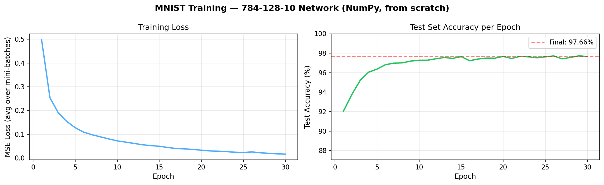
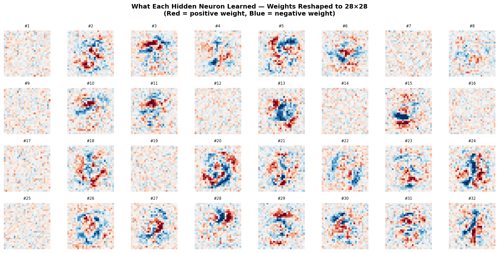
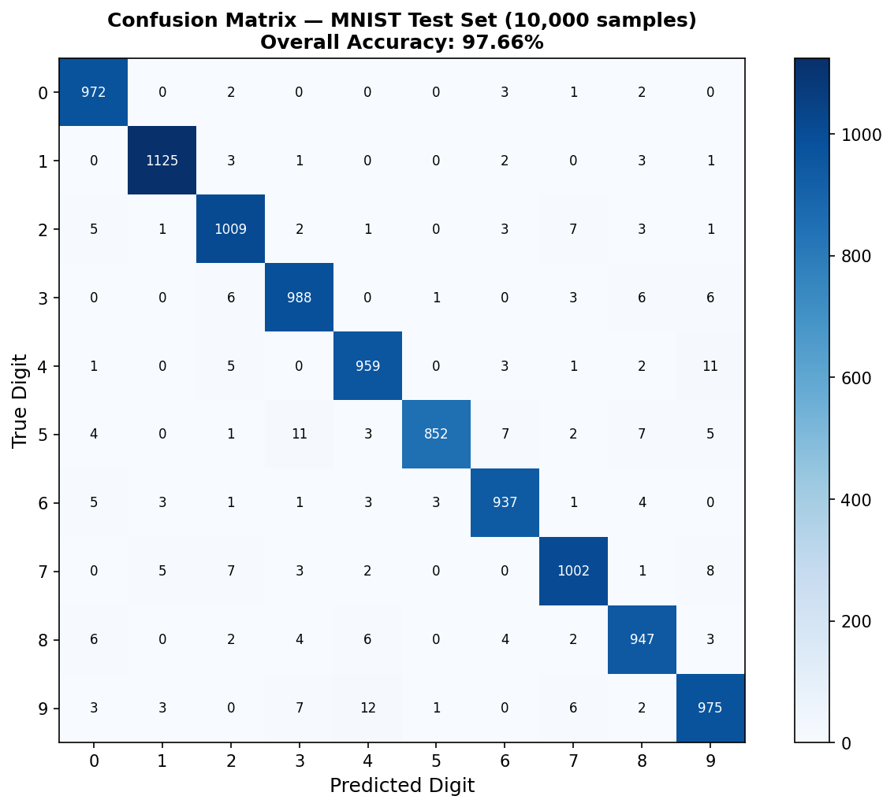
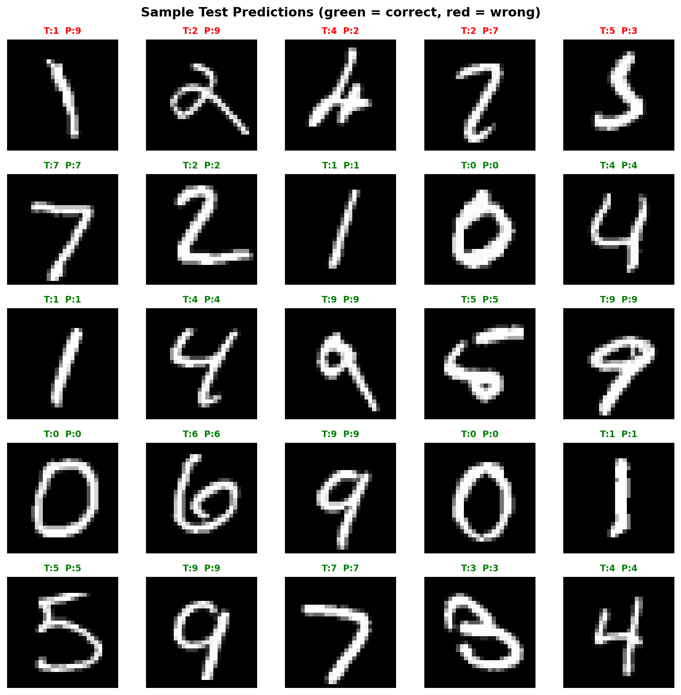
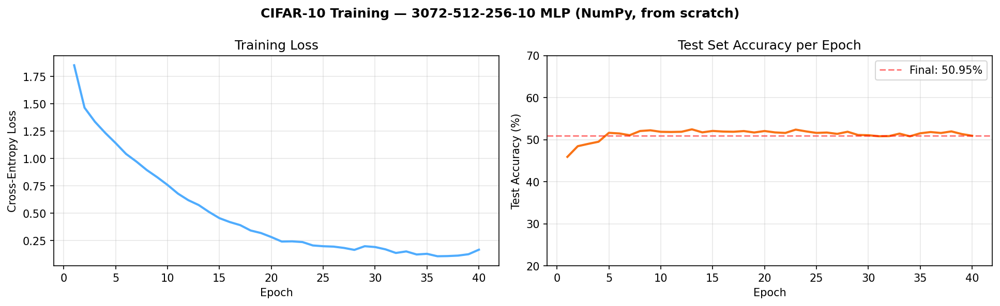
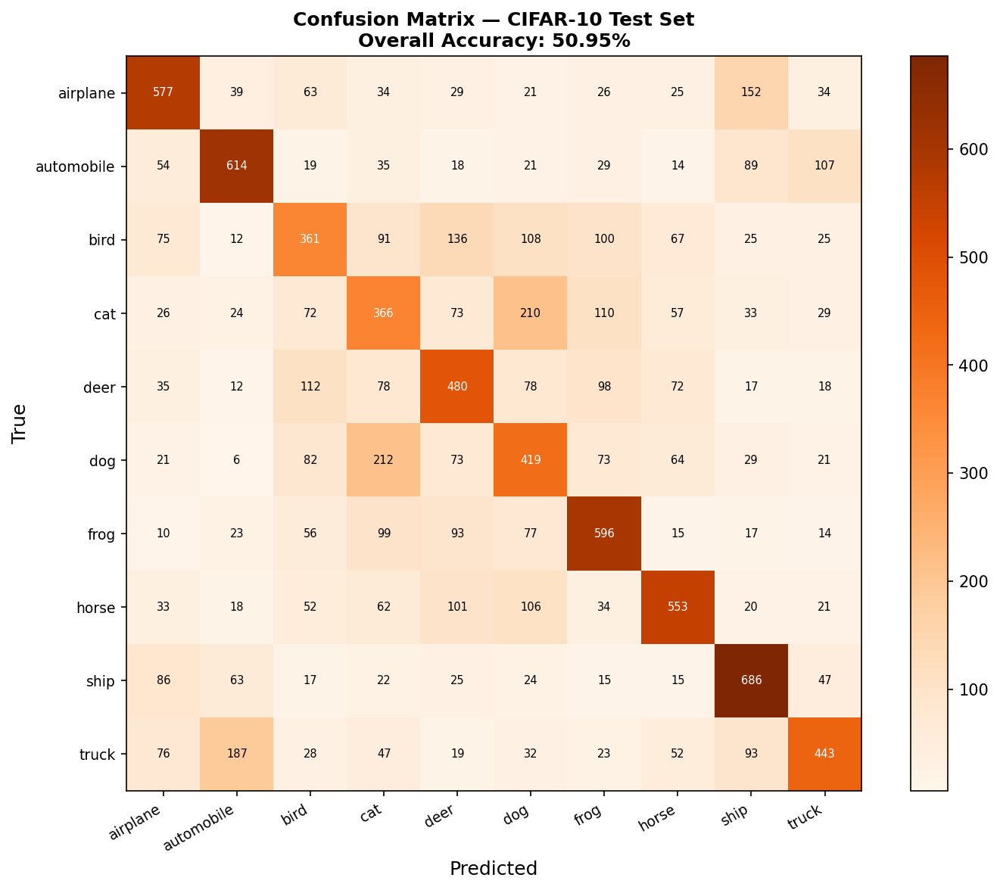
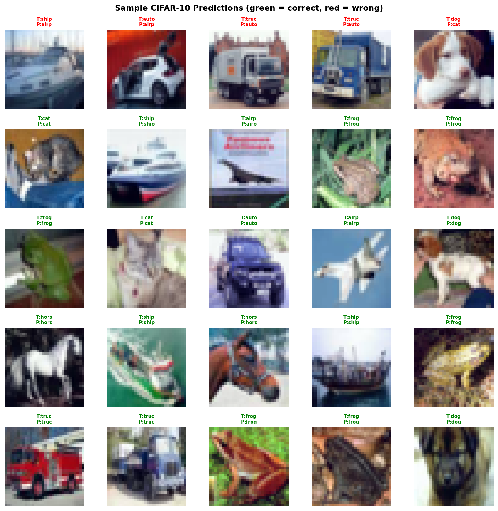
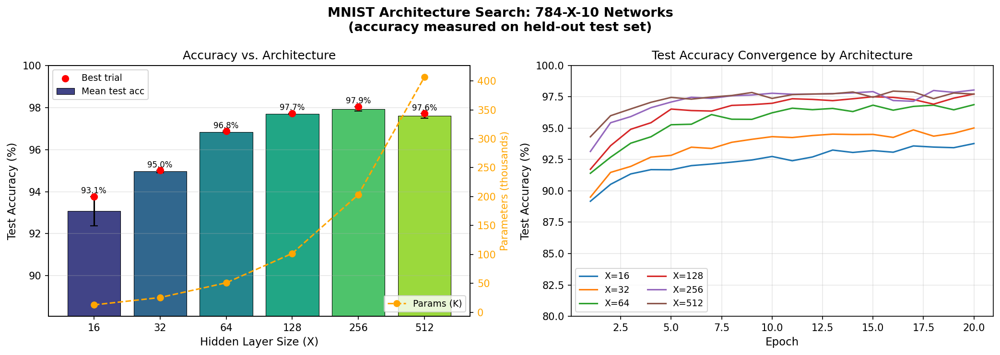

<p align="center">
  <h1 align="center">Deep Learning Framework — From Scratch in NumPy</h1>
  <p align="center">
    <strong>A modular, N-layer neural network framework built entirely without PyTorch or TensorFlow.</strong><br/>
    Implements backpropagation, Adam optimizer, multiple activations, gradient verification,<br/>
    and benchmarks on MNIST (97.66%) and CIFAR-10 (52%) — all in pure NumPy.
  </p>
  <p align="center">
    
    
    
    
    
  </p>
</p>

---

## What This Is

Most ML courses teach you to call `model.fit()`. This project implements what happens **inside** — from the chain rule to the Adam update rule — in a framework flexible enough to train on real image benchmarks.

The core class `DeepNeuralNetwork` accepts any architecture (`[784, 256, 128, 10]` or any depth), any activation, any loss, and any optimizer — configured at construction time, just like PyTorch modules.

---

## Framework Features

| Capability | Details |
|---|---|
| **Arbitrary depth** | `layer_sizes=[784, 256, 128, 64, 10]` — any N-layer network |
| **Activations** | ReLU, Sigmoid, Tanh (hidden); Softmax / Sigmoid (output) |
| **Loss functions** | Cross-entropy + Softmax, MSE + Sigmoid |
| **Optimizer** | Adam (β₁=0.9, β₂=0.999) with bias correction; SGD fallback |
| **Initialization** | He (ReLU layers), Xavier (Sigmoid/Tanh layers) |
| **Regularization** | L2 weight decay |
| **Gradient check** | Numerical verification via centered finite differences |
| **Mini-batch training** | Shuffle + batch loop, val accuracy tracked per epoch |
| **Persistence** | Save / load weights to `.npz` |

---

## Benchmarks

### MNIST — Handwritten Digits (60K samples, 10 classes)

> Architecture: 784 → 128 → 10 · Adam lr=0.001 · 30 epochs

| Metric | Value |
|---|---|
| Test accuracy | **97.66%** |
| Train accuracy | 99.61% |
| Parameters | 101,770 |
| Random baseline | 10.00% |

<p align="center">
  
</p>

**Hidden unit weight maps** — each of the 128 neurons learns to detect specific digit strokes:

<p align="center">
  
</p>

<p align="center">
  
  &nbsp;&nbsp;
  
</p>

---

### CIFAR-10 — Colour Images (50K samples, 10 classes)

> Architecture: 3072 → 512 → 256 → 10 · Adam lr=0.001 · 40 epochs · per-channel normalisation

| Metric | Value |
|---|---|
| Test accuracy | **50.95%** |
| Train accuracy | 95.38% (overfits) |
| Random baseline | 10.00% |
| Typical CNN | ~93% |

Best classes: ship 68.6%, automobile 61.4%. Worst: bird 36.1%, cat 36.6% — animals have far more pose/texture variation than vehicles, which a pixel-level model cannot capture.

<p align="center">
  
</p>

<p align="center">
  
  &nbsp;&nbsp;
  
</p>

**Why does the MLP plateau at ~51% on CIFAR-10?**  
An MLP treats every pixel independently — it has no notion of spatial structure. A CNN uses local filters (weight sharing) to detect edges and textures at any position in the image, which is why CNNs reach 93%+. This experiment makes the architectural gap concrete and measurable.

---

### Architecture Search — MNIST

Systematic sweep over hidden-layer sizes {16, 32, 64, 128, 256, 512}, 2 trials each. Accuracy is always measured on the **held-out test set** (not training set).

| Hidden size | Parameters | Mean test acc | Best |
|---|---|---|---|
| 16  | 12,730  | 93.07% ± 0.70% | 93.77% |
| 32  | 25,450  | 94.96% ± 0.05% | 95.01% |
| 64  | 50,890  | 96.84% ± 0.04% | 96.87% |
| 128 | 101,770 | 97.69% ± 0.02% | 97.72% |
| **256** | **203,530** | **97.94% ± 0.11%** | **98.04%** |
| 512 | 407,050 | 97.60% ± 0.11% | 97.71% |

Accuracy rises with capacity up to 256 units, then **drops** at 512 — more parameters is not always better (overfitting). 128 is the sweet spot: near-best accuracy at half the parameters of 256.

<p align="center">
  
</p>

---

## Gradient Verification

Backpropagation correctness is verified against numerical gradients computed via centered finite differences:

```
dL/dw  ≈  [ L(w + eps) - L(w - eps) ] / (2 * eps)
```

All 3 configurations pass with relative error ~1e-10:

```
--- Test 1: ReLU + Cross-Entropy  [6, 5, 4, 3] ---
  Layer  Param   Rel Error    Status
  1      W1      9.46e-11     PASS
  1      b1      1.20e-10     PASS
  2      W2      6.93e-11     PASS
  ...
  All gradients verified. Backpropagation is mathematically correct.

--- Test 2: Sigmoid + MSE  [5, 4, 3] ---   PASS
--- Test 3: Tanh + Cross-Entropy  [8, 6, 4, 2] ---  PASS
```

Run it yourself:
```bash
python gradient_check.py
```

---

## Core Implementation

### N-layer forward pass

```python
def forward(self, X):
    self._cache = [X]
    a = X
    for i in range(self.n_layers):
        z  = a @ self.weights[i] + self.biases[i]
        fn = self.output_activation if i == self.n_layers - 1 else self.activation
        a  = self._act(z, fn)
        self._cache.append(a)
    return a
```

### Backpropagation (generalised to N layers)

```python
# CE + Softmax: combined gradient simplifies to (a - y)/n
delta = (a_out - y) / n

for i in range(L-1, -1, -1):
    grads_w[i] = a_prev.T @ delta + (l2/n) * weights[i]
    grads_b[i] = sum(delta, axis=0)
    if i > 0:
        delta = (delta @ weights[i].T) * activation_deriv(cache[i])
```

### Adam optimizer (with bias correction)

```python
m[i] = b1 * m[i] + (1 - b1) * grad
v[i] = b2 * v[i] + (1 - b2) * grad**2
m_hat = m[i] / (1 - b1**t)
v_hat = v[i] / (1 - b2**t)
params[i] -= lr * m_hat / (sqrt(v_hat) + eps)
```

---

## Web Application

Flask app — draw a digit on the canvas and the trained MNIST network classifies it in real time.

**Preprocessing pipeline:**
```
Draw on canvas -> grayscale -> binary threshold -> invert colours
-> crop to bounding box -> add 20% padding -> resize to 28x28 (LANCZOS)
-> normalize to [-1, +1] -> flatten to 784-dim vector -> network
```

```bash
python app.py
# Open http://127.0.0.1:5000
```

---

## Project Structure

```
.
├── deep_neural_network.py       # Core framework — N-layer, Adam, CE/MSE, save/load
├── mnist_loader.py              # MNIST loader + [-1,1] normalisation
├── cifar10_loader.py            # CIFAR-10 downloader + per-channel normalisation
├── gradient_check.py            # Numerical gradient verification
├── train_mnist.py               # Train + visualise on MNIST (target ~97%)
├── train_cifar10.py             # Train + visualise on CIFAR-10 (target ~52%)
├── architecture_search_mnist.py # Hidden-size sweep — proper held-out evaluation
├── app.py                       # Flask web app — draw a digit, get a prediction
│
├── templates/
│   └── index.html               # Canvas UI with per-class confidence bars
│
├── model/
│   ├── mnist_dnn_model.npz      # Trained 784-128-10 weights
│   └── cifar10_model.npz        # Trained 3072-512-256-10 weights
│
├── results/
│   ├── mnist_training_curves.png
│   ├── mnist_weight_maps.png
│   ├── mnist_confusion_matrix.png
│   ├── mnist_sample_predictions.png
│   ├── mnist_architecture_search.png
│   ├── cifar10_training_curves.png
│   ├── cifar10_confusion_matrix.png
│   └── cifar10_sample_predictions.png
│
└── requirements.txt
```

---

## Quick Start

```bash
pip install -r requirements.txt

# Verify backpropagation is correct
python gradient_check.py

# Train on MNIST (~2 min, downloads ~170 MB first run)
python train_mnist.py

# Train on CIFAR-10 (~8 min, downloads ~163 MB first run)
python train_cifar10.py

# Architecture search (~5-8 min)
python architecture_search_mnist.py

# Web app
python app.py
```

---

## Tech Stack

| Component | Technology |
|---|---|
| Neural network framework | NumPy (pure from-scratch) |
| Datasets | MNIST via scikit-learn, CIFAR-10 via urllib |
| Visualisation | Matplotlib |
| Web framework | Flask |
| Image processing | Pillow (PIL) |
| Frontend | Vanilla HTML / CSS / JS |

---

## Project Origin

Started as a university assignment (CS6302E — Theoretical Foundations of Machine Learning, NIT Calicut) requiring a neural network for 3-class letter recognition on synthetic 8×8 pixel data. The assignment was completed, then the implementation was extended into a reusable framework and validated against MNIST and CIFAR-10 to confirm it works at real scale.

The same backpropagation logic — zero changes — powers both the toy 3-class problem and a 50,000-sample colour-image benchmark.

---

<p align="center">
  <sub>Built without frameworks — because understanding what happens inside <code>model.fit()</code> matters.</sub>
</p>
